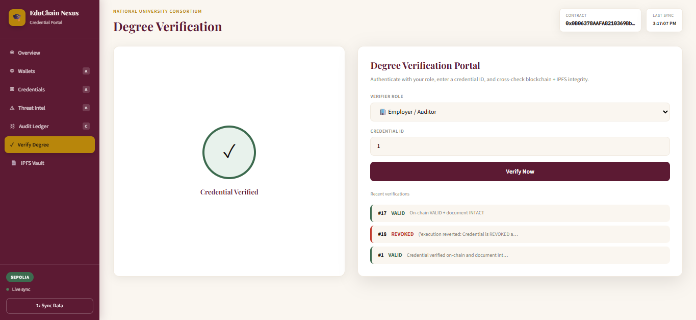

# EduChain Credential Verifier

[](https://python.org)
[](https://soliditylang.org)
[](https://sepolia.etherscan.io)
[](https://pinata.cloud)
[](LICENSE)

**Blockchain-Based Academic Credential Verification DApp** — a national university consortium platform where degrees are issued on Ethereum, stored on IPFS, protected by AI threat detection, and audited via a SHA-256 chained ledger with Merkle tree integrity.

**Repository:** [github.com/OwaisBytes/educhain-credential-verifier](https://github.com/OwaisBytes/educhain-credential-verifier)

---

<!-- SCREENSHOTS:START -->
## Demo Preview

Lab exam & live demo screenshots from the **EduChain Nexus** credential verification platform.

### SCREEN 1


| | |
|:---:|:---:|
| **SCREEN 2**<br> | **SCREEN 3**<br> |
| **SCREEN  4**<br> | **SCREEN5**<br> |
| **SCREEN 6**<br> | **SCREEN 7**<br> |
| **SCREEN 8**<br> | **SCREEN 10**<br> |

_Total: 9 screenshot(s)_
<!-- SCREENSHOTS:END -->

---

## Features

- **Part A — Wallet Identity & Smart Contract**
  - Deterministic ECDSA wallets (Registrar, Student, Employer)
  - Session-based login (`VERIFIED` / `FAILED` / `EXPIRED`)
  - `CredentialRegistry.sol` on Sepolia with `onlyRegistrar` access control
  - Issue, revoke, transfer, and verify credentials on-chain

- **Part B — IPFS & AI Threat Detection**
  - SHA-256 Content Identifiers (CID) for certificate documents
  - Pinata IPFS pinning for real decentralized storage
  - Document tamper detection (`INTACT` / `TAMPERED`)
  - IsolationForest ML + rule-based threat classification (`LOW` / `MEDIUM` / `HIGH`)

- **Part C — Ledger, Merkle Tree & Dashboard**
  - SHA-256 chained transaction audit log (10+ runtime events)
  - Merkle tree built from scratch (tamper demo + Merkle proof)
  - **EduChain Nexus** web dashboard with live API data
  - Employer credential verification portal

---

## Tech Stack

| Layer | Technology |
|-------|------------|
| Blockchain | Ethereum Sepolia Testnet |
| Smart Contract | Solidity ^0.8.20 |
| Chain Client | Web3.py |
| Backend | Python 3.11, Flask |
| Frontend | HTML / CSS / JavaScript (EduChain Nexus UI) |
| Storage | Pinata IPFS + SHA-256 CID |
| Cryptography | ECDSA + SHA-256 |
| AI/ML | scikit-learn IsolationForest |
| Tools | Remix IDE, MetaMask, VS Code |

---

## Quick Start

### 1. Clone the repository

```bash
git clone https://github.com/OwaisBytes/educhain-credential-verifier.git
cd educhain-credential-verifier
```

### 2. Install dependencies

```bash
pip install -r requirements.txt
python scripts/compile_contract.py
```

### 3. Configure environment

Copy `.env.example` to `.env` and fill in your keys:

```bash
cp .env.example .env
```

| Variable | Description |
|----------|-------------|
| `NETWORK` | `sepolia` or `local` |
| `SEPOLIA_PRIVATE_KEY` | MetaMask Sepolia account private key |
| `PINATA_API_KEY` | Pinata API key |
| `PINATA_SECRET` | Pinata secret |
| `PINATA_JWT` | Pinata JWT (optional) |

> **Never commit `.env` to GitHub.** It is listed in `.gitignore`.

### 4. Run terminal demo

```bash
python backend/main.py
```

### 5. Run web dashboard (recommended)

```bash
python server.py
```

Opens **http://127.0.0.1:5000** in your browser.

Or on Windows: double-click `start_dashboard.bat`

---

## Project Structure

```
educhain-credential-verifier/
├── contracts/
│   ├── CredentialRegistry.sol      # Solidity smart contract
│   └── CredentialRegistry.json     # Compiled ABI + bytecode
├── backend/
│   ├── part_a/                     # Identity, auth, Web3 contract client
│   ├── part_b/                     # IPFS storage, AI threat detection
│   ├── part_c/                     # Chained ledger, Merkle tree, dashboard
│   ├── main.py                     # Full pipeline orchestrator
│   └── api.py                      # Flask API + web dashboard server
├── web/
│   ├── templates/index.html        # EduChain Nexus UI
│   └── static/                     # CSS + JavaScript
├── certificates/                   # Sample degree JSON files
├── screenshots/                    # Demo screenshots (add yours here)
├── docs/
│   ├── REMIX_METAMASK_PINATA.md    # Remix + MetaMask setup guide
│   └── LAB_EXAM_REPORT.docx        # Lab report template
├── scripts/
│   ├── compile_contract.py
│   └── generate_lab_report.py
├── server.py                       # Start web dashboard
├── requirements.txt
└── .env.example
```

---

## End-to-End Workflow

```
Wallet Login → Session Verified → Smart Contract Deploy (Sepolia)
     → Credential Registered → Certificate on IPFS (Pinata)
     → AI Forgery/Threat Check → Transaction Hashed & Chained
     → Merkle Root Generated → Web Dashboard Rendered
```

---

## Web Dashboard

The **EduChain Nexus** dashboard includes:

| Section | Content |
|---------|---------|
| Overview | Pipeline, contract address, Merkle root, AI stats |
| Wallets | ECDSA identity cards (Part A) |
| Credentials | Issued degrees VALID/REVOKED (Part A) |
| Threat Intel | AI alert feed (Part B) |
| Audit Ledger | Transaction timeline + Merkle (Part C) |
| Verify Degree | Employer credential verification |
| IPFS Vault | Pinata document links |

### Verify Credential API

```http
POST /api/verify-credential
Content-Type: application/json

{
  "session_token": "<token from /api/demo-login>",
  "credential_id": 1
}
```

Response: `VALID` | `REVOKED` | `FORGED` | `NOT FOUND`

---

## Smart Contract Functions

| Function | Access | Description |
|----------|--------|-------------|
| `issueCredential(name, registrar, cid)` | Registrar only | Issue new credential |
| `revokeCredential(id)` | Registrar only | Revoke credential |
| `transferCredentialOwnership(id, owner)` | Owner | Transfer ownership |
| `getCredential(id)` | Public | Read credential data |
| `verifyCredential(id)` | Public | Verify — reverts if REVOKED |

---

## Remix + MetaMask + Pinata

See [docs/REMIX_METAMASK_PINATA.md](docs/REMIX_METAMASK_PINATA.md) for manual deployment via Remix IDE.

---

## Lab Exam Outputs

| Part | Required Output |
|------|-----------------|
| A | Identity table, login results, contract address, 2 issued + 1 revoked credential |
| B | CID mapping, tamper demo, AI threat table, HIGH alerts |
| C | Transaction log, Merkle root, proof verification, dashboard screenshots |

Full report template: `docs/LAB_EXAM_REPORT.docx`

Screenshot checklist: [screenshots/README.md](screenshots/README.md)

---

## Author

**OwaisBytes** — [GitHub](https://github.com/OwaisBytes)

---

## License

MIT License — see [LICENSE](LICENSE) for details.
